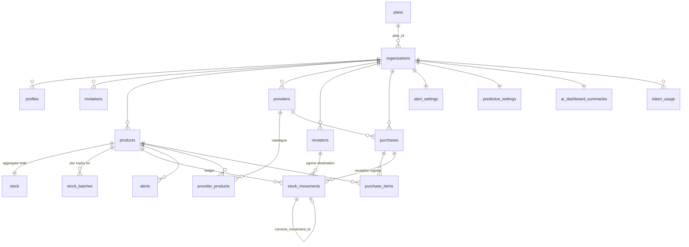
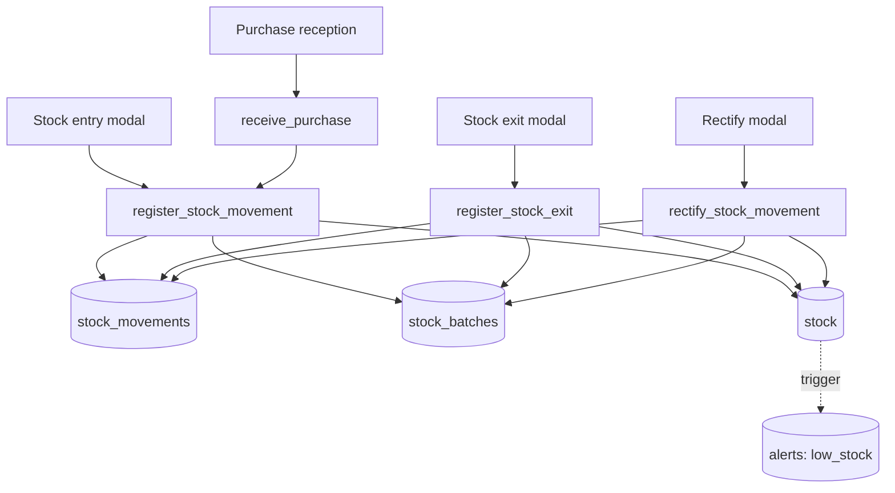

# Med+Inv — Architecture & Design Reference

> **Vintage:** accurate as of commit `fa3333a` (2026-07-23), branch `fix/dashboard-tweaks`.
> When behaviour and this document disagree, the code wins — please fix the document.

This is the long-form reference for maintaining and extending Med+Inv. It complements,
rather than replaces:

- [CLAUDE.md](../CLAUDE.md) / [AGENTS.md](../AGENTS.md) — terse agent-facing operating instructions.
- [docs/feature-spec-alerts-orders-predictive.md](feature-spec-alerts-orders-predictive.md) — the
  *requirements* spec written **before** the build. Many of its open questions are now
  answered in code; where the two disagree, this document records the resolution.

---

## Table of contents

1. [Overview](#1-overview)
2. [Repository map](#2-repository-map)
3. [Request lifecycle & authentication](#3-request-lifecycle--authentication)
4. [Authorization model](#4-authorization-model)
5. [Data model](#5-data-model)
6. [Database functions & write paths](#6-database-functions--write-paths)
7. [Inventory domain](#7-inventory-domain)
8. [Purchases & providers](#8-purchases--providers)
9. [Alerts](#9-alerts)
10. [Predictive engine](#10-predictive-engine)
11. [AI assistant](#11-ai-assistant)
12. [Billing & subscriptions](#12-billing--subscriptions)
13. [Frontend conventions](#13-frontend-conventions)
14. [Internationalisation](#14-internationalisation)
15. [Testing & runtime verification](#15-testing--runtime-verification)
16. [Adding a new module](#16-adding-a-new-module)
17. [Design decisions log](#17-design-decisions-log)
18. [Known constraints & gotchas](#18-known-constraints--gotchas)

---

## 1. Overview

Med+Inv is a **multi-tenant medical-supply inventory system** for small health
institutions (clinics, pharmacies, care homes). One Supabase project hosts every
tenant; isolation is enforced by Postgres Row-Level Security keyed on the
organisation id carried in the user's JWT.

The product surface, in rough dependency order:

| Module | Route | What it does |
|---|---|---|
| Products | `/products` | Supply catalogue: name, EAN, presentation, category, VED criticality |
| Stock | `/stock` | Current levels, lot (batch) tracking, entry/exit/rectify, movements report + export |
| Alerts | `/alerts` | Low stock, near-expiry lots, reorder suggestions; thresholds and toggles |
| Purchases | `/purchases` | Purchase orders with partial-acceptance reconciliation into stock |
| Providers | `/providers` | Supplier records and their product catalogues |
| Receptors | `/receptors` | Egress destinations (patients / departments) recorded on exits |
| Predictive | `/predictive` | Demand estimation, reorder points, suggested order quantities, backtest |
| AI assistant | `/asistencia-ia` | Read-only stock chatbot, per-screen "explain", chief-doctor dashboard summary |
| Users | `/users` | Invite and deactivate members (chief doctor only) |
| Subscription | `/cuenta/suscripcion` | Mercado Pago plan management (chief doctor only) |

### Tenancy and roles

Every domain table carries `organization_id`. The **source of truth for tenancy and
role is the JWT** (`app_metadata.organization_id`, `app_metadata.role`) — never a join
through `profiles`, because RLS policies that self-join a policied table deadlock or
recurse. `profiles` mirrors the same values for display and admin listing.

Four roles, defined in [lib/constants/roles.ts](../lib/constants/roles.ts):

| Role | Scope |
|---|---|
| `chief_doctor` | Everything, plus user management and billing |
| `doctor` | **Inventory only** — products and stock movements |
| `nurse` | Inventory + all operations |
| `administrative` | Inventory + all operations (same as nurse) |

The mental model: *inventory writing* is granted to all four; *operations*
(purchases, providers, receptors, alert/predictive configuration, reports,
dashboard) is granted to everyone **except** `doctor`; *administration* (users,
subscription, AI dashboard summary) is `chief_doctor` only.

### Stack

| Concern | Choice | Notes |
|---|---|---|
| Framework | **Next.js 16.2.7**, App Router | `middleware.ts` is deprecated → [proxy.ts](../proxy.ts) |
| UI | **React 19.2.4** | Server Components by default; Server Actions + `useActionState` |
| Data / auth | **Supabase** via `@supabase/ssr` 0.10 | Postgres + RLS + Auth |
| Styling | **Tailwind CSS v4** (PostCSS plugin) | `@theme inline` over CSS custom properties |
| Validation | **Zod 4** | Schemas emit snake_case i18n keys |
| i18n | **next-intl 4** | Spanish only, "no routing" mode |
| LLM | **`@anthropic-ai/sdk`** | `claude-opus-4-8` |
| Billing | **Mercado Pago** preapprovals | REST + signed webhook |
| Tests | **Vitest 4** + Testing Library | Unit + live-project RLS integration |
| Barcode | `@zxing/browser` | Must be in `transpilePackages` — see [next.config.ts](../next.config.ts) |
| Export | `xlsx` (CDN tarball), `jspdf` + autotable | Client-side, dynamically imported |

Language: the entire UI, all copy, all model prompts and all DB error keys are
**Spanish (es-AR)**. Code, comments and this document are English.

---

## 2. Repository map

```
app/
  (auth)/                     login, sign-up, forgot/reset password, onboarding,
                              auth/{callback,confirm,invite,complete-profile,reset-password}
  (checkout)/checkout/        Mercado Pago card brick
  (dashboard)/                authenticated shell — layout.tsx is the gate
    <module>/page.tsx         Server Component: auth → role gate → query → render
    <module>/actions.ts       "use server" mutations for that module
    stock/query.ts            shared movements query builder (page + export)
  api/
    ai/{chat,explain,dashboard-summary}/route.ts
    mp/{subscribe,webhook,subscription/{activate,change}}/route.ts
  layout.tsx                  fonts, IntlProvider, theme/density data-attributes
  globals.css                 the whole design system (~550 lines)

components/
  <module>/                   client components for that module ("use client")
  dashboard/                  Sidebar (server), SidebarNav + DashboardShell (client)
  ui/                         shared primitives: Pagination, DataCard, FilterBar,
                              InfoTip, Icons (SVG sprite), Logo, Stepper, AuthArt
  tutorial/                   TutorialProvider + TutorialOverlay
  scanner/BarcodeScanner.tsx  camera EAN scanning

lib/
  supabase/{client,server,middleware,admin}.ts   the four client contexts
  supabase/database.types.ts                     hand-merged generated types
  constants/{roles,categories,criticality,receptor-types}.ts
  schemas/<module>/*.ts       Zod schemas (validation keys → messages/es.json)
  predictive/                 demand model, FEFO projection, alert sync
  ai/                         prompts, tools, streaming loop, quota, wire format
  mp/                         preapproval REST wrappers + signed checkout cookie
  export/                     movements CSV/XLSX/PDF generation
  tutorial/steps.ts           per-screen tutorial registry
  org.ts                      organisation provisioning (service role)
  pagination.ts               resolvePage / resolvePageSize / PAGE_SIZE_OPTIONS
  i18n/zod.ts                 installs the Spanish Zod locale globally

supabase/migrations/          checked-in mirror of what was applied live
messages/es.json              every user-facing string, by namespace
i18n/request.ts              next-intl request config
tests/{predictive,ai,rls}/    unit tests + live-project RLS integration tests
.claude/skills/verify/        SSR-HTML runtime verification drivers
```

---

## 3. Request lifecycle & authentication

### 3.1 The proxy (not middleware)

Next.js 16 deprecated `middleware.ts`. The equivalent is [proxy.ts](../proxy.ts) at the
project root, exporting a **named** function `proxy` (not a default export, not
`middleware`). `config.matcher` works as before.

```ts
// proxy.ts
export async function proxy(request: NextRequest) {
  return await updateSession(request);
}
```

[`updateSession`](../lib/supabase/middleware.ts) **must** call `supabase.auth.getUser()`.
That call is what triggers the refresh-token rotation and writes the updated cookies
onto the response. Removing it silently breaks session continuity — sessions expire
and users get bounced to `/login` mid-work.

### 3.2 The four Supabase client contexts

| File | Key | Used from | RLS |
|---|---|---|---|
| [lib/supabase/client.ts](../lib/supabase/client.ts) | publishable | Client Components | applies |
| [lib/supabase/server.ts](../lib/supabase/server.ts) | publishable | Server Components, Server Actions, Route Handlers | applies |
| [lib/supabase/middleware.ts](../lib/supabase/middleware.ts) | publishable | `proxy.ts` only | applies |
| [lib/supabase/admin.ts](../lib/supabase/admin.ts) | **service role** | narrow set of server-only paths | **bypassed** |

`server.ts` requires the caller to `await cookies()` and pass the store in — a Next 16
constraint, since `cookies()` is async and cannot be called inside the client factory.

The **service-role client is a loaded gun**. It is legitimate in exactly five places,
all of which need to cross tenant boundaries or write tables no client may touch:

1. [lib/org.ts](../lib/org.ts) — provisioning an organisation, then stamping
   `app_metadata` on the auth user.
2. [app/(dashboard)/users/actions.ts](../app/(dashboard)/users/actions.ts) — sending
   invites and toggling `profiles.active`.
3. [app/(auth)/auth/callback/route.ts](../app/(auth)/auth/callback/route.ts) — syncing
   `app_metadata` for an invited user on first login.
4. [lib/ai/quota.ts](../lib/ai/quota.ts) — reading **org-wide** token consumption
   (RLS would only show the caller their own rows) and inserting `token_usage`.
5. `app/api/mp/*` — Mercado Pago flows, including the webhook, which has no session
   at all.

Anything else should use the RLS-scoped client. New code reaching for `createAdminClient()`
is a design smell worth challenging in review.

### 3.3 The environment key name

```
NEXT_PUBLIC_SUPABASE_URL
NEXT_PUBLIC_SUPABASE_PUBLISHABLE_KEY   ← not ..._ANON_KEY
SUPABASE_SERVICE_ROLE_KEY
NEXT_PUBLIC_SITE_URL
AUTH_EMAIL_MODE                        ← optional: real | dev-link (see §3.5)
ANTHROPIC_API_KEY
MP_ACCESS_TOKEN, MP_WEBHOOK_SECRET, MP_COOKIE_SECRET, MP_CURRENCY_ID,
NEXT_PUBLIC_MP_PUBLIC_KEY, MP_TEST_*
```

Older Supabase guides use `NEXT_PUBLIC_SUPABASE_ANON_KEY`. This project does not.

### 3.4 Route groups and the dashboard gate

Three route groups, each with its own shell:

- `(auth)` — unauthenticated pages plus the post-auth plumbing routes.
- `(checkout)` — the Mercado Pago card brick, reached only with a valid pending-checkout cookie.
- `(dashboard)` — everything behind a session.

[app/(dashboard)/layout.tsx](../app/(dashboard)/layout.tsx) is the single gate, and it
does five things on **every** dashboard request:

1. `getUser()` → redirect `/login` if absent.
2. Read `profiles` for `organization_id`, `full_name`, `role` → redirect `/onboarding`
   if the user has no organisation yet.
3. `hasAiAccess()` to decide whether the AI nav item is live or shows a "Pro" badge.
4. **Refresh alerts**: `sweep_alerts()` RPC (expiry) then `syncReorderAlerts()`
   (predictive). See [§9](#9-alerts) for why this happens on page load rather than on a schedule.
5. Count unacknowledged active alerts for the sidebar badge.

Individual pages then re-check their own role gate (`canViewPredictive`, `canViewDashboard`, …)
and redirect to `/products` — the one screen every role can see — when denied.

### 3.5 Sign-up, onboarding and invitation flows

```
sign-up ──▶ (real) email confirm ──▶ /auth/callback ──▶ /onboarding
        └─▶ (dev-link) auto-confirmed + immediate sign-in ──▶ /onboarding

/onboarding ── free plan ──▶ provisionOrganization ─▶ refreshSession ─▶ /dashboard
            └─ paid plan ──▶ signed pending-checkout cookie ─▶ /checkout ─▶ /api/mp/subscribe

invite (chief) ──▶ Supabase invite email ──▶ /auth/invite ──▶ /auth/complete-profile

any flow, email send failed ──▶ console link ──▶ /auth/verify ──▶ …
```

Three details that trip people up:

- **Email mode is a switch, not a `NODE_ENV` check.** `sendsRealAuthEmails()` in
  [lib/auth/email-mode.ts](../lib/auth/email-mode.ts) reads `AUTH_EMAIL_MODE`
  (`real` | `dev-link`), defaulting to `dev-link` under `next dev`. In `dev-link` mode
  sign-up uses `admin.createUser({ email_confirm: true })` plus an immediate
  `signInWithPassword`, and the other flows print a link instead of sending mail.
  Set `AUTH_EMAIL_MODE=real` to exercise the production paths locally (e.g. for a demo).
- **A generated link and an emailed link are mutually exclusive.** `auth.one_time_tokens`
  is unique on `(user_id, token_type)`, so `admin.generateLink()` *replaces* whatever
  token was mailed out. `logAuthLinkFallback()` therefore only runs when the real send
  returned an error — never alongside a successful one. `npm run auth:link -- recovery
  <email>` does the same thing on demand, and prints a warning to that effect.
  The links it produces point at [/auth/verify](../app/(auth)/auth/verify/route.ts),
  which consumes the `token_hash` with `verifyOtp` server-side; `properties.action_link`
  is deliberately unused because its implicit-flow hash fragment never reaches the server
  (the same trap that shaped the sign-up dev branch).
- **Invited users get their JWT patched on first callback.** The invitation sets
  `profiles.organization_id`, but `app_metadata` is only stamped when
  [auth/callback](../app/(auth)/auth/callback/route.ts) notices the mismatch and calls
  `admin.updateUserById`. Until that runs, RLS sees no organisation and the user
  would be bounced to `/onboarding`.
- **After any change to `app_metadata`, call `supabase.auth.refreshSession()`** before
  redirecting, or the browser keeps a JWT without the new organisation/role and every
  RLS check fails.

---

## 4. Authorization model

### 4.1 Three enforcement layers

| Layer | Where | Purpose |
|---|---|---|
| Navigation | [components/dashboard/Sidebar.tsx](../components/dashboard/Sidebar.tsx) | Hide what the role can't use |
| Page / action | `page.tsx` redirects, `actions.ts` guards | Fail fast with a translatable error key |
| **RLS** | Postgres policies | The only layer that actually secures anything |

The first two are convenience. Anything that matters must be a policy, because a
determined client can call PostgREST directly with its own JWT.

### 4.2 The capability matrix

Helpers in [lib/constants/roles.ts](../lib/constants/roles.ts) mirror the policies
installed by [20260720000001_role_matrix_alignment.sql](../supabase/migrations/20260720000001_role_matrix_alignment.sql).
**These two must be changed together** — the helper file says so in a comment, and it
is the single most common source of "the button is there but the write fails".

| Capability | Helper | Roles | Enforced by |
|---|---|---|---|
| Write products, stock, movements, batches, `ean_lookup` | `canWriteInventory` | all four | `writers insert/update/manage …` policies |
| Manage purchases | `canManagePurchases` | chief, nurse, administrative | `writers manage purchases` / `… purchase items` |
| Manage providers | `canManageProviders` | chief, nurse, administrative | `operations manage providers` / `… provider_products` |
| Manage receptors | `canCreateReceptors` / `canManageReceptors` | chief, nurse, administrative | `operations insert/update receptors` |
| Configure alerts | `canManageAlerts` | chief, nurse, administrative | `operations manage alert_settings` |
| Configure predictive | `canManagePredictive` | chief, nurse, administrative | `operations manage predictive_settings` |
| View alerts / predictive / reports / dashboard | `canViewAlerts`, `canViewPredictive`, `canViewReports`, `canViewDashboard` | chief, nurse, administrative | **nothing — UI only** |
| Invite / deactivate users | inline `role !== "chief_doctor"` check | chief | service-role client; `profiles` policies are dead (see §18) |
| Manage subscription | inline check in `app/api/mp/*` | chief | route guard only |
| AI dashboard summary | inline check in the route | chief | `chief_doctor reads/manages ai_dashboard_summaries` |

**The `canView*` helpers are cosmetic.** Reads stay org-scoped for every role at the
database level — a `doctor` who queries `/rest/v1/alerts` directly will get their
organisation's alerts back. These helpers hide UI the role matrix reserves for
operational roles; they are not a confidentiality boundary. If a read ever needs to be
genuinely restricted by role, it needs a new SELECT policy, not a new helper.

### 4.3 The SQL side

Two helper functions, both `security invoker`, read the JWT:

```sql
current_organization_id()  -- (auth.jwt()->'app_metadata'->>'organization_id')::uuid
current_role()             -- auth.jwt()->'app_metadata'->>'role'
```

`current_role` must be **double-quoted** in policies (`"current_role"()`) — it collides
with the SQL standard `current_role` keyword.

The near-universal policy shape:

```sql
-- read: any member of the org
using (organization_id = current_organization_id())

-- write: member of the org AND an allowed role
using  (organization_id = current_organization_id() and "current_role"() = any (array[…]))
with check (organization_id = current_organization_id() and "current_role"() = any (array[…]))
```

---

## 5. Data model

18 tables plus one view, all in `public`, all with RLS enabled.



### 5.1 Tenancy & billing

| Table | Key columns | RLS |
|---|---|---|
| `plans` | `id text` (!), `name`, `monthly_price`, `user_limit`, `token_limit_per_month`, `mp_plan_id` | readable by everyone |
| `organizations` | `name`, `plan_id`, `mp_subscription_id`, `subscription_status`, `billing_cycle`, `current_period_end` | members read their own |
| `profiles` | `id` = `auth.users.id`, `organization_id`, `full_name`, `role`, `active` | own row; chief reads org |
| `invitations` | `email`, `role`, `invited_by`, `accepted` | chief inserts; invitee reads own |

`plans.id` is `text` in the live database despite the `uuid` in the baseline migration —
the baseline documents an earlier state and was never the applied truth for that column.
`token_limit_per_month > 0` is the AI entitlement flag (see [§11](#11-ai-assistant)).

A trigger `handle_new_user` (`security definer`) on `auth.users` inserts the matching
`profiles` row with `full_name` from `raw_user_meta_data`. Migrations `20260628000001`
and `…02` tried to extend it and then reverted — the current shape is the simple one.

### 5.2 Catalogue

| Table | Notes |
|---|---|
| `products` | `ean`, `name`, `presentation`, `category`, `criticality`, `unit`, `active`. Unique `(organization_id, ean)`; a violation (`23505`) is surfaced as the field error `ean_duplicate`. **`name` is never updated** — it is locked for historical accuracy of movement records. |
| `ean_lookup` | Global (not org-scoped) EAN→name cache populated on product creation; readable by any authenticated user. |

`category`, `criticality` and receptor `patient_type` are **code-defined stable keys**,
not DB enums and not user-editable rows:
[categories.ts](../lib/constants/categories.ts), [criticality.ts](../lib/constants/criticality.ts),
[receptor-types.ts](../lib/constants/receptor-types.ts). Their labels live in
`messages/es.json`. Adding a value means editing the constant (and the migration's
CHECK constraint, for `criticality`).

### 5.3 Inventory — the three-table triad

This is the heart of the system and the easiest thing to corrupt.

| Table | Role |
|---|---|
| `stock` | One row per `(org, product)`: `quantity` (aggregate total) + `min_quantity` (the per-product low-stock floor) |
| `stock_batches` | One row per `(org, product, expiry_date)`: on-hand quantity of that lot |
| `stock_movements` | Append-only ledger: `type`, `quantity`, `expiry_date`, `notes`, `receptor_id`, `purchase_id`, `corrects_movement_id` |

**Invariant: `stock.quantity == sum(stock_batches.quantity)` for every product.**
Nothing in the database enforces this; it is maintained solely by the RPCs in
[§6](#6-database-functions--write-paths). This is why *stock ingress must never write
these tables directly* — a raw insert breaks the invariant silently and the predictive
engine, the alerts and the FEFO egress all start lying.

Notable index: `stock_batches` uses
`unique nulls not distinct (organization_id, product_id, expiry_date)` (PG15+), so the
single "no expiry tracked" bucket upserts cleanly instead of creating a new row per write.

Movement types: `entry`, `exit`, `adjustment`, `expiry`. Only `entry` and `exit` are
rectifiable, and only those two feed the demand series.

### 5.4 Supply chain

| Table | Notes |
|---|---|
| `providers` | Internal records only — no automated communication. Unique on `(organization_id, lower(name))`. |
| `provider_products` | Many-to-many catalogue. Pricing lives on the order line, not here, because price is a point-in-time fact. |
| `purchases` | `status` ∈ `draft \| confirmed \| received \| cancelled`; `provider_id`; legacy free-text `supplier` retained for pre-providers rows. |
| `purchase_items` | `quantity` (ordered, never mutated), `unit_price`, `expiry_date`, `accepted_quantity` (nullable; `0` = line rejected). |
| `receptors` | Egress destination. `external_id` is the strong key when present; name uniqueness applies **only** to receptors without an external id, so the inline quick-create path (name only) cannot produce accidental duplicates while two real patients may still share a name. |

### 5.5 Intelligence & metering

| Table | Notes |
|---|---|
| `alerts` | `type` ∈ `low_stock \| expiry \| reorder_suggested`; `status` ∈ `active \| resolved`; `quantity`/`threshold` snapshots; `acknowledged_at/_by`. Three **partial unique indexes** (one per type, `where status = 'active'`) implement fire-once dedup. |
| `alert_settings` | One row per org: per-type enable toggles + `expiry_days_ahead`. |
| `predictive_settings` | One row per org: `lead_time_days` (**null = auto**), `coverage_days`, `safety_days_{vital,essential,desirable}`. |
| `ai_dashboard_summaries` | One cached row per org; `content jsonb` is the validated model blob. Chief-doctor-only for both read and write. |
| `token_usage` | One row per assistant turn: `input_tokens`, `output_tokens`. |
| `monthly_token_consumption` | **View** (`security_invoker`): `sum(input+output)` grouped by org/user/`date_trunc('month', created_at)`. |

---

## 6. Database functions & write paths

Thirteen functions in `public`. Security mode is not decoration — `definer` means the
function can write tables the caller has no policy for, so its body must pin the
organisation from the JWT and never from an argument.

| Function | Security | Purpose |
|---|---|---|
| `current_organization_id()` | invoker | JWT → org uuid |
| `current_role()` | invoker | JWT → role text |
| `register_stock_movement(product, type, qty, expiry, notes, purchase_id)` | invoker | **The** ingress path: movement + batch + aggregate in one tx |
| `register_stock_exit(product, qty, notes, receptor_id)` | invoker | FEFO egress across lots |
| `rectify_stock_movement(movement, new_qty, new_expiry, reason)` | invoker | Compensating correction, never mutates history |
| `_apply_batch_delta(org, product, expiry, delta)` | invoker | Batch upsert helper; raises `insufficient_stock` on negative |
| `create_purchase(provider, notes, items)` | invoker | Atomic order header + lines |
| `receive_purchase(purchase, items)` | invoker | Reconciliation; pushes accepted qty through `register_stock_movement` |
| `sweep_alerts()` | **definer** | Expiry alert sweep + disabled-type cleanup for the caller's org |
| `sync_reorder_alerts(items)` | **definer** | Applies the predictive model's reorder verdict |
| `_sync_low_stock_alert()` | **definer** | Trigger on `stock` — fires/resolves low-stock alerts |
| `handle_new_user()` | **definer** | Trigger on `auth.users` — creates the `profiles` row |
| `set_updated_at()` | invoker | Generic `updated_at` touch trigger |

### 6.1 Why `security invoker` for the write RPCs

The stock and purchase RPCs are `security invoker` **on purpose**: RLS still applies, so
the RPC is a transactional convenience, not a privilege escalation. A `doctor` calling
`create_purchase` is rejected by the `writers manage purchases` policy exactly as a
direct insert would be. Only the three alert functions are `definer`, because clients
deliberately have **no** insert/update grant on `alerts` at all:

```sql
revoke insert, update, delete on table alerts from anon, authenticated;
grant update (acknowledged_at, acknowledged_by) on table alerts to authenticated;
```

Column-level grants mean a user can acknowledge an alert and nothing else — they cannot
resolve it, retype it or fabricate one.

### 6.2 Errors are i18n keys

Every RPC raises snake_case exceptions that double as message keys resolved through the
`Errors` namespace in [messages/es.json](../messages/es.json):

`not_authenticated`, `invalid_quantity`, `invalid_type`, `invalid_price`,
`insufficient_stock`, `movement_not_found`, `already_rectified`, `not_rectifiable`,
`no_change`, `purchase_not_found`, `purchase_not_receivable`, `items_mismatch`,
`items_required`, `product_not_found`, `product_not_provided`, `provider_not_found`,
`receptor_not_found`, `invalid_payload`.

Server Actions pass these strings straight through to the client, which translates them.
[i18n/request.ts](../i18n/request.ts) returns unknown keys verbatim, so a raw Supabase
error never renders as a blank string.

### 6.3 Foreign keys do not respect RLS

Every RPC that accepts a foreign id re-checks its organisation explicitly:

```sql
if p_receptor_id is not null then
  if not exists (select 1 from receptors
                 where id = p_receptor_id and organization_id = v_org and active)
  then raise exception 'receptor_not_found'; end if;
end if;
```

A plain FK would happily accept another tenant's uuid — FK validation does not run
policies. The same guard exists for `purchase_id` in `register_stock_movement` and for
`provider_id`/`product_id` in `create_purchase`.

### 6.4 Changing an RPC signature

Adding a parameter creates an **overload**, which makes PostgREST RPC resolution
ambiguous (`PGRST203`) and leaves the old signature's grant dangling. Always
`drop function if exists <name>(<old arg types>);` first, then recreate and re-grant.
See [20260712000001](../supabase/migrations/20260712000001_receptors.sql) and
[20260712000002](../supabase/migrations/20260712000002_movements_purchase_link.sql).

---

## 7. Inventory domain

### 7.1 Write paths



Four entry points, three tables, one invariant. Note that purchase reception is not a
parallel ingress path — it funnels into `register_stock_movement`, which is why a
received order produces proper batch rows and fires low-stock resolution automatically.

### 7.2 FEFO egress

`register_stock_exit` walks lots **earliest-expiry-first, undated last**, emitting one
`exit` movement per lot it draws from (so the ledger records which lot was consumed),
decrementing each batch, and finally decrementing the aggregate. It pre-checks total
availability and raises `insufficient_stock` before touching anything.

The predictive engine's projection in [lib/predictive/expiry.ts](../lib/predictive/expiry.ts)
deliberately mirrors this exact ordering. If the RPC's consumption order ever changes,
that file must change with it or the forecast diverges from reality.

### 7.3 Rectification

Movements are **never** mutated or deleted. `rectify_stock_movement` emits compensating
movement(s) tagged with `corrects_movement_id`:

- Same expiry → one net compensating movement.
- Expiry changed → two movements (remove from the old lot, add to the new).
- `p_new_quantity = 0` nulls the original out entirely.

Guards: a movement that already corrects something, or has already been corrected,
raises `already_rectified`; only `entry`/`exit` are `not_rectifiable`-exempt; a no-op
raises `no_change`.

This matters downstream: `buildConsumptionSeries` in
[lib/predictive/data.ts](../lib/predictive/data.ts) nets compensating pairs back onto
the **original movement's date**, so a correction entered today does not create a
phantom demand spike today.

### 7.4 The movements report

[app/(dashboard)/stock/query.ts](../app/(dashboard)/stock/query.ts) builds one query
shared by the paginated page (`.range`) and the export action (`.limit`). Three
PostgREST subtleties are encoded there and are easy to reintroduce as bugs:

- **Sorting by an embedded column uses `"table(column)"` syntax**, not
  `{ referencedTable }` — the latter orders rows *inside* the embed, not the top-level
  result. `MOVEMENT_SORT_COLUMNS` is the whitelist.
- **Filtering on an embed requires `!inner`.** Without it, the filter merely nulls the
  embed and keeps the row. `products` is always `!inner` (a NOT NULL FK, so it drops
  nothing); `purchases` flips to `!inner` **only** when the provider filter is active,
  because otherwise every movement without a purchase would vanish.
- **Provider-name sort is not offered** — it sits two embeds deep
  (`purchases → providers`), which PostgREST cannot order by.

A stable `created_at` tiebreak is appended to non-date sorts so pagination cannot
duplicate or drop rows.

### 7.5 Export

Export is client-side and lazily loaded: `xlsx` and `jspdf` are `await import()`-ed on
first use in [lib/export/movements.ts](../lib/export/movements.ts), so they never enter
the initial bundle or the server build. The server action returns **raw codes**
(category, criticality, type, patient type) capped at `EXPORT_MAX_ROWS = 5000`; the
client resolves them to labels via i18n, keeping `es.json` the single label source.
CSV is written with a UTF-8 BOM and CRLF so Excel decodes accents correctly.

The shared types live in [movements-types.ts](../lib/export/movements-types.ts) rather
than the action file because a `"use server"` module may only export async functions.

---

## 8. Purchases & providers

### 8.1 Lifecycle

```
draft ──confirm──▶ confirmed ──receive──▶ received
  │                    │
  └──── cancel ────────┴──▶ cancelled
```

`confirmed` means "marked as sent to the provider". Both `draft` and `confirmed` are
receivable; anything else raises `purchase_not_receivable`.

### 8.2 Partial acceptance

`receive_purchase` records, per line, how much actually entered stock
(`accepted_quantity`; `0` = line rejected). **The ordered `quantity` is never mutated**,
so discrepancies stay visible for audit and for later predictive use.

The payload must cover **every** line of the purchase — the function counts lines,
counts distinct matched ids and compares both against `jsonb_array_length`, raising
`items_mismatch` on any drift. This prevents a partial payload from silently marking an
order received with lines unaccounted for.

### 8.3 Provider catalogue enforcement

When an order is tied to a provider, every line must be a product that provider actually
supplies (`provider_products`), else `product_not_provided`. Orders **without** a
provider (informal restocking logged for the record) stay unrestricted. The UI mirrors
this: `searchOrderProducts` narrows to the provider's catalogue when one is selected,
full catalogue otherwise.

### 8.4 Traceability

Reception passes `p_purchase_id` into `register_stock_movement`, so ingress movements
carry `purchase_id` and the movements report can filter by provider through
`movement → purchase → provider`. Movements created before
[20260712000002](../supabase/migrations/20260712000002_movements_purchase_link.sql)
were **not backfilled**; they keep a `purchase:<uuid>` note and are recoverable via
`substring(notes from '^purchase:(.*)$')::uuid` if that ever becomes necessary.

---

## 9. Alerts

### 9.1 The three types

| Type | Fires when | Evaluated by |
|---|---|---|
| `low_stock` | `stock.quantity <= stock.min_quantity` | trigger on `stock`, synchronously |
| `expiry` | a lot with `quantity > 0` expires within `expiry_days_ahead` | `sweep_alerts()` on page load |
| `reorder_suggested` | the predictive model says "order now" | `sync_reorder_alerts()` on page load |

`reorder_suggested` is advisory and fires **earlier** than `low_stock` by design — the
reorder point is `demand × lead time + safety stock`, which is ≥ the static
`min_quantity` floor. The two coexist deliberately: they answer different questions
("should I order?" vs. "am I dangerously low?").

### 9.2 Lifecycle

Accepted 2026-07-05: **fire once per condition, auto-resolve when the condition clears,
re-arm after resolution.** A recurrence creates a *new* row, so history is preserved.
Acknowledging only silences the unread badge — the alert stays `active` until the
underlying condition actually clears.

Dedup is enforced by three partial unique indexes (`where type = … and status = 'active'`),
which also give the `on conflict … do update` refresh clause its target.

### 9.3 No scheduler — on purpose

Email delivery was deferred, so there is no cron. Low stock is evaluated synchronously
by a trigger (every ingress and egress path funnels through `stock`); expiry and reorder
are swept on dashboard page load from
[app/(dashboard)/layout.tsx](../app/(dashboard)/layout.tsx). Cheap at this scale, and
`pg_cron` can take the sweeps over unchanged if email ever lands.

`syncReorderAlerts` is fire-and-forget: it catches everything and logs, because alert
sync must never break a page render.

### 9.4 The 2026-07-23 correction

`sync_reorder_alerts` originally re-derived its own trigger condition in SQL
(`stock.quantity <= reorder_point`). That was wrong twice over:

1. **Reactive, not forward-looking** — it fired only once stock had *already* fallen to
   the reorder point, so the model's lead-time lookahead (which fires early when an
   expiring lot would strand stock mid-lead-time) could never reach it. The alert
   arrived exactly too late to act on, which is the case it exists to prevent.
2. **Raw aggregate, not usable stock** — `stock.quantity` still counts lots that already
   expired (nothing writes them off), so the alert stayed silent whenever dead stock
   padded the total above the reorder point.

[20260723000001](../supabase/migrations/20260723000001_reorder_alert_lookahead.sql) makes
the model the single source of truth. The payload from
[lib/predictive/alerts.ts](../lib/predictive/alerts.ts) now carries
`{ product_id, reorder_point, usable_stock, should_fire }`, and the function stops
reading `stock.quantity` for the decision — the `stock` join survives purely as the
cross-tenant guard it always doubled as.

**These two files must ship together.** A payload without `should_fire` fires nothing
and resolves everything.

Consequence worth knowing: zero-demand products have a reorder point but no reorder
day, so they no longer raise `reorder_suggested`. That is intended — there is nothing
to reorder without demand, and `low_stock` still covers the floor.

### 9.5 Accepted residual risk

`sync_reorder_alerts` is `security definer` and takes advisory reorder points from the
client. An org member can therefore fabricate or resolve *their own organisation's*
reorder alerts by calling it with arbitrary values. This was accepted as the same trust
altitude as the existing acknowledge grant — no cross-tenant surface exists, since the
`stock` join pins products to the caller's org.

---

## 10. Predictive engine

### 10.1 The swap seam

[lib/predictive/base.ts](../lib/predictive/base.ts) defines an abstract
`PredictiveModel` interface; [index.ts](../lib/predictive/index.ts) exports the single
active instance:

```ts
export const predictiveModel: PredictiveModel = new RegressionRopModel();
```

Consumers (the page, the dashboard tile, the AI tools) depend only on the interface, so
replacing the formula-based model with an ML one is a one-line change. `predict()` is
`async` specifically so a remote implementation can slot in without an API change.

**The model is implemented in TypeScript once and never duplicated in SQL.** That is why
reorder alerts are pushed into the database rather than computed there.

### 10.2 Demand estimation

[regression-rop.ts](../lib/predictive/regression-rop.ts) picks one of three methods:

| Method | Condition | Estimate |
|---|---|---|
| `insufficient_data` | fewer than **3** distinct consumption days | nothing — all outputs null |
| `average` | 3–4 days, or span < **14** days | `total consumed / span` |
| `regression` | ≥ **5** consumption days **and** span ≥ **14** days | least-squares over the **zero-filled** daily series, evaluated at today |

Zero-filling is load-bearing: regressing only over active days ignores the idle
stretches and materially overestimates demand.

Demand comes from `exit` movements only, with rectification pairs netted onto the
original date (see [§7.3](#73-rectification)).

### 10.3 The formulas

```
safetyStock    = max(minQuantity, dailyDemand × safetyStockDays)
reorderPoint   = ceil(dailyDemand × leadTimeDays + safetyStock)
orderHorizon   = leadTimeDays + coverageDays
target         = dailyDemand × orderHorizon + safetyStock
suggestedQty   = max(0, ceil(target − (usableStock − projectedWaste)))
```

`safetyStockDays` comes from the product's VED criticality and the org's
`predictive_settings` (defaults: vital 7, essential 3, desirable 0; unclassified 0).
Taking `max` with `min_quantity` means a manually raised per-product threshold still wins.

`suggestedQuantity` subtracts projected waste from usable stock — stock that will lapse
before demand reaches it does not count toward the coverage target.

### 10.4 FEFO projection and the lead-time lookahead

[expiry.ts](../lib/predictive/expiry.ts) is pure (no Supabase) so it is unit-testable.
`simulateFefo` walks the horizon day by day: drop lots that expired as of that day, record
the level, then consume `dailyDemand` earliest-expiry-first. It answers "what happens if
I do nothing" — no replenishment is assumed.

Three stock figures, and conflating them is the classic bug:

| Figure | Meaning |
|---|---|
| `current_stock` | raw `stock.quantity`, **including already-expired lots** |
| `usableStock` | minus lots past their expiry date — what the UI should lead with |
| `expiredStock` | the difference; a write-off, not a forecast |
| `projectedWaste` | units expected to expire *unconsumed* within the horizon |

`daysUntilReorder` is not simply "usable ≤ reorderPoint today". The model finds the
**first day whose stock, projected a lead time later, would fall to the safety buffer**:

```ts
for (let k = 0; k <= daysToSafety; k++) {
  if (levels[k + lead] <= safetyStock) { daysUntilReorder = k; break; }
}
```

Under smooth depletion this reduces exactly to `usable <= reorderPoint`. An expiry cliff
inside the lead-time window makes it fire **earlier** — before the cliff can strand stock
below safety with an order still in transit. This temporal walk is the thing SQL cannot
redo, and the reason [§9.4](#94-the-2026-07-23-correction) exists.

A product with **no batch rows** predates batch tracking; its aggregate is treated as a
single never-expiring lot, which reduces every formula above to the pre-expiry behaviour.

### 10.5 Lead time

`predictive_settings.lead_time_days` is nullable, and **null means auto**:
[lead-time.ts](../lib/predictive/lead-time.ts) averages each product's
`received_at − created_at` across received purchases, one sample per order line, floored
at 1 day, falling back to `DEFAULT_LEAD_TIME_DAYS = 7`. `created_at` is order *creation*
— the only order-side timestamp that exists — so "delivery time" means creation → reception.

The purchases query is only paid for when lead time is actually on auto.

### 10.6 Backtest

[detail.ts](../lib/predictive/detail.ts) refits the model on history **strictly before**
a 30-day window ending today, then projects across it (`regression` extends its trend,
`average` is flat) and aligns that against actual zero-filled consumption. Today's lots
say nothing about a past window, so the refit runs with `batches: []` — only its demand
estimate is used to draw the projected line.

### 10.7 Data assembly

`getPredictions()` in [data.ts](../lib/predictive/data.ts) is the shared seam used by
`/predictive`, the dashboard tile and the AI tools. It issues four parallel RLS-scoped
queries (settings, stock+product, movements, batches), builds the consumption series and
batch groups, runs the model per product, and sorts **most-urgent-first** with
no-estimate products last.

`/predictive` computes the full list and paginates by slicing, so the urgency sort is
global rather than per page — and the same rows feed `syncReorderAlerts` without a
second computation.

---

## 11. AI assistant

### 11.1 Gating and quota

Access is plan-based: `hasAiAccess()` in [lib/ai/access.ts](../lib/ai/access.ts) is
simply `plans.token_limit_per_month > 0`. Routes use `getTokenLimit()` instead, since
the same query serves both the gate and the quota check.

**Counting rule** ([quota.ts](../lib/ai/quota.ts)), applied identically everywhere:

```
inputTokens  = Σ over API loop iterations of
               usage.input_tokens + cache_creation_input_tokens + cache_read_input_tokens
outputTokens = Σ usage.output_tokens
quota used   = input + output
```

Cached reads are billed far cheaper by Anthropic but count **1:1** here, because the plan
limit reads literally as "tokens processed per month". `estimateUsd()` exists for display
only and is an upper bound; enforcement stays token-based.

Consumption is **org-wide** and requires the service-role client — the
`monthly_token_consumption` view is `security_invoker`, and `token_usage` RLS shows a
user only their own rows (org-wide for chief). Month buckets are UTC, matching the view's
`date_trunc`.

### 11.2 The shared route skeleton

All three routes ([chat](../app/api/ai/chat/route.ts),
[explain](../app/api/ai/explain/route.ts),
[dashboard-summary](../app/api/ai/dashboard-summary/route.ts)) follow the same order:

```
getUser → org present? → limit > 0? → ANTHROPIC_API_KEY set? → parse body (Zod)
→ org monthly consumption vs limit → run the turn → meter in `finally`
```

Two conventions worth preserving:

- **Pre-stream failures are JSON** `{ ok: false, error: "<Errors key>" }` with a real
  status code; **once the model turn starts, everything travels as NDJSON on a 200**,
  including errors. The client switches on `Content-Type`.
- **Metering happens in `finally`.** Usage objects are mutated in place by the turn
  runner, so partial consumption is still recorded when the client disconnects or the
  turn throws mid-loop.

### 11.3 Prompt caching constraint

System prompts in [lib/ai/prompt.ts](../lib/ai/prompt.ts) **must stay byte-stable across
requests** — prompt caching is a prefix match. No dates, no organisation names, no
interpolation of any kind. The current date and all dynamic context ride on the last
*user* message, after the cache breakpoint.

The same applies to `CHAT_TOOLS`: tools render *before* the system prompt, so
**reordering the tool array invalidates the cache**. The array order is fixed and
commented as such.

### 11.4 Tools

Four read-only executors in [lib/ai/tools.ts](../lib/ai/tools.ts), all running on the
caller's RLS-scoped client so org scoping is automatic:

| Tool | Returns | Caps |
|---|---|---|
| `get_stock_levels` | levels, optionally lots | `STOCK_ROW_CAP = 200` |
| `get_alerts` | alerts by type/status | limit 1–50, default 20 |
| `get_predictions` | urgency-sorted predictions | limit 1–50, default 15 |
| `get_product_prediction_detail` | single-product detail + backtest | `CONSUMPTION_POINT_CAP = 60` |

Model arguments are untrusted input: each tool has a Zod schema, and a parse failure
becomes an `is_error` tool result so the model can correct itself instead of failing the
request. Limits are clamped server-side regardless of what the model asks for.

### 11.5 The three surfaces

**Chat** (`/asistencia-ia`) — streaming tool-use loop in
[lib/ai/chat.ts](../lib/ai/chat.ts). Up to `MAX_TOOL_ITERATIONS = 8` round trips
(a well-behaved turn uses 1–3), `max_tokens` 8192 per iteration, adaptive thinking on.
Two details that are easy to break: the **full** assistant content (thinking blocks
included) must be pushed back for replay, and **all tool results go in one user
message** — splitting them degrades parallel tool use on later turns.

**Explain** — one-shot "analyse this screen". Same skeleton, but **no tools**: the
context is rebuilt server-side in [lib/ai/explain.ts](../lib/ai/explain.ts) by calling
the chatbot's own executors, so queries, caps and JSON shape live in exactly one place.
Nothing the browser sends can inject data into the analysis. Screen instructions are
model-facing prose and deliberately stay out of i18n.

**Dashboard summary** — chief-doctor only, and structurally different: a **single
non-streaming forced-tool call**. The model must answer by calling
`emit_dashboard_summary`, so the output is a structured blob
(`headline`, `summary`, `actions[]`, `chart|null`) validated against
[dashboard-summary.ts](../lib/schemas/asistencia-ia/dashboard-summary.ts) rather than
free text. Notes:

- Extended thinking is **off** — forced `tool_choice` is incompatible with it.
- The tool's `input_schema` mirrors the Zod schema as a convenience contract; **Zod is
  the source of truth**, because the model can drift.
- A malformed `chart` does not lose a valid text summary: the code retries validation
  with `chart: null` before giving up.
- Results are cached one row per org in `ai_dashboard_summaries`; the tile reads the
  cache and only re-fires on an explicit "Regenerate". A stored blob that fails
  validation (an old shape) is treated as absent so the tile regenerates.
- A persist failure logs but still returns the content — the user waiting on it should
  not lose it.

### 11.6 Wire format

[lib/ai/wire.ts](../lib/ai/wire.ts) is deliberately client-safe (no server-only imports)
so both the route and `"use client"` components import the same types. One JSON event per
line over a plain `ReadableStream`:

```ts
{ type: "text",  delta }
{ type: "tool",  name }
{ type: "done",  usage, truncated? }
{ type: "error", key }        // key resolves against the Errors namespace
```

`createNdjsonParser` handles chunks that split a line anywhere or carry several at once,
and skips malformed lines rather than killing the stream.

---

## 12. Billing & subscriptions

### 12.1 Flow

```
/onboarding ─ free plan ──▶ provisionOrganization ──▶ refreshSession ──▶ /dashboard
            └ paid plan ──▶ setPendingCheckoutCookie ──▶ /checkout
                              └─▶ POST /api/mp/subscribe
                                    ├ createPreapproval (Mercado Pago)
                                    ├ provisionOrganization
                                    ├ refreshSession
                                    └ deletePendingCheckoutCookie
```

Existing organisations upgrading from free take `/api/mp/subscription/activate` instead,
which is identical except it **updates** the organisation rather than creating one.
Plan changes go through `/api/mp/subscription/change`: paid→paid updates the preapproval
amount in place; paid→free cancels the preapproval and nulls `mp_subscription_id`;
free→paid returns `REQUIRES_CHECKOUT` because a new card token is needed.

### 12.2 Security properties

- **The pending-checkout cookie is HMAC-signed** ([lib/mp/cookie.ts](../lib/mp/cookie.ts)):
  `base64url(payload).hex(HMAC-SHA256)`, `httpOnly`, `sameSite=lax`, 30-minute TTL,
  constant-time comparison. It carries the org name, plan id and billing cycle across the
  onboarding→checkout hop without trusting the browser.
- **Prices are never taken from the client.** Both subscribe routes re-read
  `plans.monthly_price` server-side; annual is `round(monthly_price × 0.8)`.
- **The webhook verifies `x-signature`** (`ts=…,v1=…`) against the manifest
  `id:<data.id>;request-id:<x-request-id>;ts:<ts>;` with constant-time comparison, then
  **always returns 200** — including on signature failure — so Mercado Pago does not
  retry misconfigured-secret cases forever.
- Status mapping: `authorized → active`, `paused → past_due`, `cancelled → cancelled`,
  anything else `pending`. A rejected authorised payment sets `past_due`; an approved one
  advances `current_period_end`.

`scripts/seed-mp-plans.ts` (`npm run seed:mp-plans`) creates the Mercado Pago preapproval
plans and writes their ids back to `plans.mp_plan_id`.

---

## 13. Frontend conventions

### 13.1 Server / client split

Server Components are the default. `"use client"` is required — as the **first line** —
for anything using hooks or browser APIs. By convention everything in `components/` is a
client component; everything in `app/**/page.tsx` is a Server Component that fetches and
delegates.

The standard page shape:

```tsx
export default async function XServerPage({ searchParams }: { searchParams: Promise<{…}> }) {
  const sp = await searchParams;              // Next 16: searchParams is a Promise
  const supabase = createClient(await cookies());
  const { data: { user } } = await supabase.auth.getUser();
  if (!user) redirect("/login");
  if (!canViewX(user.app_metadata?.role)) redirect("/products");

  const page = resolvePage(sp.page);
  const pageSize = resolvePageSize(sp.size);
  const { data, count } = await query.range(from, to);

  return <XPage rows={data ?? []} count={count ?? 0} page={page} pageSize={pageSize} canWrite={…} />;
}
```

Server-only gating props (functions, predicates) must be stripped before crossing into a
client component — see the `adminOnly`/`visible` cleanup in
[Sidebar.tsx](../components/dashboard/Sidebar.tsx). Props must be serializable.

### 13.2 Server Actions

Every mutation is a Server Action in the module's `actions.ts`, consumed with
`useActionState`. The uniform result shape:

```ts
type XResult = { ok: boolean; errors: { field?: string[]; _form?: string[] }; data?: … };
```

Field keys match the Zod schema; `_form` carries whole-form failures. Values are
**message keys**, not sentences. Standard body: parse with Zod → `getUser` → role check →
org id from `app_metadata` → write → map known Postgres error codes (e.g. `23505` →
`ean_duplicate`) → `revalidatePath` for every affected route.

Note that `revalidatePath` fan-out matters: a product edit revalidates `/products`,
`/stock` **and** `/predictive`, because all three read that row.

### 13.3 Validation → error pipeline

```
Zod schema ──▶ snake_case key ──▶ Server Action result ──▶ client ──▶ t(key)
                                                                      ↓
                                        messages/es.json → Validation | Errors
```

[lib/i18n/zod.ts](../lib/i18n/zod.ts) installs the Spanish Zod locale globally (imported
once from the root layout) so built-in Zod messages are Spanish too.

### 13.4 Design system

[app/globals.css](../app/globals.css) is the whole system in one file: Tailwind v4
`@theme inline` maps utility colours onto CSS custom properties, so themes switch by
swapping variables rather than classes.

- **Three palettes** via `data-theme` on `<html>`: `boticario` (default, warm),
  `clinico` (cool), `esmeralda` (deep). Semantic tokens: `--c-primary`, `--c-ink{,-2,-3}`,
  `--c-page`, `--c-surface{,-2}`, `--c-sidebar`, `--c-line{,-2}`, plus
  `--c-{ok,warn,danger,info}` with `-soft` companions.
- **Two densities** via `data-density`: `comfortable` (default) and `compact`, driving
  `--d-*` spacing and control heights.
- Component classes (`mi-topbar`, `mi-drawer`, `mi-nav-item`, `mi-iconbtn`, …) live
  alongside the tokens.

Both attributes are set on `<html>` in [app/layout.tsx](../app/layout.tsx).

### 13.5 Shared UI primitives

| Component | Purpose |
|---|---|
| [Pagination](../components/ui/Pagination.tsx) | Range label + page controls + `?size=` selector, wired to `PAGE_SIZE_OPTIONS` |
| [DataCard](../components/ui/DataCard.tsx) | Expandable card that replaces a table row on mobile |
| [FilterBar](../components/ui/FilterBar.tsx) | Shared filter chrome |
| [InfoTip](../components/ui/InfoTip.tsx) | Info icon + **portalled** tooltip (in-flow bubbles get clipped by `overflow` wrappers) |
| [Icons](../components/ui/Icons.tsx) | `IconSprite` rendered once in the layout; components reference `<use href="#i-…">` |
| [Stepper](../components/ui/Stepper.tsx), [Logo](../components/ui/Logo.tsx), [AuthArt](../components/ui/AuthArt.tsx) | Onboarding / branding chrome |

Every list screen follows the same responsive pattern: a table on desktop, `DataCard`s on
mobile, server-side pagination via `?page=`/`?size=`, filters in the query string.
`DataCard`'s header is a `div` with manual button semantics, not a `<button>`, because
some headers contain a `<Link>` and interactive elements cannot nest inside a button.

### 13.6 Tutorial & help

[lib/tutorial/steps.ts](../lib/tutorial/steps.ts) is a registry: `TUTORIALS[screenId]` is
an ordered list of `{ id, target? }`. `target` matches a `data-tutorial="…"` attribute in
the DOM; a step with no target renders a centred intro card. **Steps whose target is
missing at runtime are silently dropped**, so it is safe to register steps for role-gated
buttons or empty states.

Copy lives under `Tutorial.<screen>.<id>_{title,body}` in `es.json`; completion is
remembered in `localStorage` under `medinv.tutorial.v1.<screen>`.

Adding a screen means: register it in `TUTORIALS`, add it to `SCREEN_BY_PATH`, add the
`data-tutorial` attributes, and add the i18n keys. Missing any one of those yields a
tutorial that silently does nothing.

---

## 14. Internationalisation

next-intl v4 in **no-routing** mode: [i18n/request.ts](../i18n/request.ts) hard-codes
`locale = "es"`, there is no `[locale]` segment and no locale negotiation.

The critical configuration is the fallback:

```ts
getMessageFallback({ key }) { return key; }
```

Unknown keys render **as themselves**. That is what lets raw Supabase/Postgres error
strings pass through the same `t()` call as curated keys without rendering blank.

Namespaces in [messages/es.json](../messages/es.json): `Common`, `Login`, `SignUp`,
`Terms`, `ForgotPassword`, `ResetPassword`, `CompleteProfile`, `Sidebar`, `Home`,
`Onboarding`, `Users`, `InviteModal`, `EditUserModal`, `Settings`, `Checkout`,
`Subscription`, `AuthArt`, `Stepper`, `Footer`, `Validation`, `Faq`, `Tutorial`,
`InviteCallback`, `Errors`, `Categories`, `Criticality`, `PatientTypes`, `Units`,
`Products`, `Providers`, `Receptors`, `Purchases`, `Stock`, `Alerts`, `Predictive`,
`AsistenciaIA`, `Scanner`.

`Validation` (~36 keys) and `Errors` (~34 keys) are **flat** namespaces holding the
snake_case keys emitted by Zod schemas and Postgres exceptions.

Two rules:

- **Codes travel, labels resolve.** Server actions and exports emit stable codes
  (`analgesics`, `vital`, `exit`, `social_security`); the client translates. `es.json`
  stays the single label source.
- **Model-facing prose is not i18n.** Prompts and screen instructions in `lib/ai/` are
  inputs to a model, not UI copy, and live in code.

Adding a second language: add `messages/<locale>.json`, make `i18n/request.ts` resolve
the locale (cookie or header), and add a locale switcher. No routing changes are required
because the app never had locale-prefixed routes.

---

## 15. Testing & runtime verification

### 15.1 Unit tests

`npx vitest run tests/predictive tests/ai` — jsdom environment, no external services.
Covers the demand model and method selection, FEFO/expiry math, the backtest series, the
token-counting rule, the NDJSON parser, tool argument schemas and explain-context building.

The pure-function split exists for this reason: `expiry.ts`, `backtest.ts` and the model
itself take no Supabase client, so they are testable without a database.

### 15.2 RLS integration tests

```bash
npx vitest run tests/rls
```

These run against the **live Supabase project**. Each suite creates ephemeral
organisations and users (`admin.auth.admin.createUser` with
`app_metadata: { role, organization_id }`), exercises cross-tenant and cross-role access,
and cleans up children-first in `afterAll`.

- They are `// @vitest-environment node`.
- Vitest does not load `.env.local`, so each file parses it manually.
- They **self-skip** (`describe.skipIf`) without `SUPABASE_SERVICE_ROLE_KEY`, so a
  contributor without credentials still gets a green run.
- Timeouts are raised (`testTimeout: 30s`, `hookTimeout: 60s`) because user creation and
  sign-in are slow.

Any new table needs an RLS suite. `tests/rls/reorder-alerts.test.ts` is the model for
testing an RPC's behaviour rather than just its policies.

### 15.3 The `verify` skill

No Playwright is installed. [.claude/skills/verify/](../.claude/skills/verify/) drives the
running app over HTTP with a real session cookie: it mints ephemeral users, hand-builds
the `@supabase/ssr` cookie (`sb-<ref>-auth-token` = `base64-` + base64url(JSON session),
chunked at 3180 chars), fetches pages with `redirect: "manual"` and asserts on SSR HTML.

Its documented blind spots are worth internalising:

- **The RSC flight payload embeds the entire `messages/es.json` bundle in every page's
  HTML.** A bare `html.includes("some string")` matches even when the string is never
  rendered. Anchor assertions to rendered DOM with a leading `>` — negative assertions
  are simply wrong without this.
- **Layout/sizing bugs are invisible to SSR drivers.** Both recent dashboard card bugs
  (`ea7b8cb`, `a89f7b8`) produced correct HTML and correct CSS. Use
  `verify-dashboard-layout.mts` for anything about a box growing, cropping or overflowing.
- Media-query behaviour (drawer, breakpoints) is not observable over HTTP.
- Active-nav state *is* SSR'd (`usePathname` renders server-side), so
  `class="mi-nav-item is-active"` is assertable.

---

## 16. Adding a new module

The eight existing modules all follow this shape. Skipping a step usually produces a
silent failure rather than an error.

1. **Migration** — write `supabase/migrations/<timestamp>_<name>.sql` **and** apply it
   with `mcp__supabase__apply_migration`. Both, always: the repo file is the design record
   and the fresh-database path. Include `enable row level security` plus read and write
   policies matching the role matrix.
2. **Types** — update [lib/supabase/database.types.ts](../lib/supabase/database.types.ts)
   by **hand-merging**. The raw generator drops the hand-tightened literal union types
   (roles, statuses, movement types) that the app relies on.
3. **Atomic writes** — if a mutation spans more than one table, write a
   `security invoker` RPC that raises snake_case error keys. Never write `stock`,
   `stock_batches` or `stock_movements` outside the existing RPCs.
4. **Schema** — `lib/schemas/<module>/<name>.ts`, emitting snake_case validation keys.
5. **Role helper** — add a `canX()` to [lib/constants/roles.ts](../lib/constants/roles.ts)
   with a comment naming the policy it mirrors.
6. **Page** — `app/(dashboard)/<module>/page.tsx`: auth → role gate → `resolvePage`/
   `resolvePageSize` → query with `{ count: "exact" }` and `.range()` → render.
7. **Actions** — `app/(dashboard)/<module>/actions.ts` with the `{ ok, errors }` shape and
   `revalidatePath` for every affected route.
8. **Components** — `components/<module>/`, `"use client"` first line, `useActionState`,
   `Pagination` + `DataCard` for the responsive list.
9. **Navigation** — add to `NAV_GROUPS` in [Sidebar.tsx](../components/dashboard/Sidebar.tsx)
   with a `visible` predicate or `adminOnly`.
10. **i18n** — new namespace in `messages/es.json`, plus any new `Validation`/`Errors` keys.
11. **Tutorial** — register in `TUTORIALS` and `SCREEN_BY_PATH`, add `data-tutorial`
    attributes, add `Tutorial.<screen>.*` keys.
12. **Tests** — an RLS suite in `tests/rls/`; unit tests for any pure logic.

Walking `receptors` end to end
([migration](../supabase/migrations/20260712000001_receptors.sql),
[page](../app/(dashboard)/receptors/page.tsx),
[actions](../app/(dashboard)/receptors/actions.ts),
[components](../components/receptors/),
[schema](../lib/schemas/receptors/receptor.ts),
[test](../tests/rls/receptors.test.ts)) is the fastest way to see all twelve steps in one
feature.

---

## 17. Design decisions log

Dated, with the migration or commit that carries each one. Most of these are recorded in
migration header comments — this is the collected view.

**2026-06-29 — Batch-level expiry tracking.**
[20260629000002](../supabase/migrations/20260629000002_stock_batches_egress.sql).
The spec asked whether expiry should be per-product or per-batch. Per-batch won: a product
arrives in multiple orders with different expiry dates, and per-product expiry would be
wrong the moment that happens. `stock` stays as the aggregate + threshold; `stock_batches`
holds the lots; the RPCs maintain both. Existing data was backfilled from the movement
ledger so the invariant held from day one.

**2026-06-29 — FEFO egress and non-destructive rectification.** Same migration.
Exits consume earliest-expiry-first and emit one movement per lot touched. Corrections
never mutate history — they emit compensating movements tagged with `corrects_movement_id`.

**2026-07-05 — Alert lifecycle: fire once, auto-resolve, re-arm.**
[20260706000001](../supabase/migrations/20260706000001_alerts.sql).
Recurrences create new rows so history is kept. Acknowledging silences the badge only.

**2026-07-05 — No scheduler.** Same migration. Email was deferred, so low stock is a
synchronous trigger and expiry is a page-load sweep. `pg_cron` can take over unchanged if
email lands.

**2026-07-05 — Partial acceptance on order reception.**
[20260705000004](../supabase/migrations/20260705000004_orders_receive.sql).
`accepted_quantity` per line; ordered quantity never mutated, so discrepancies stay
auditable and available to future predictive work.

**2026-07-05 → 2026-07-07 — EOQ dropped in favour of ROP.**
[20260706000003](../supabase/migrations/20260706000003_predictive_settings.sql) added EOQ
inputs (ordering cost, holding cost rate);
[20260707000001](../supabase/migrations/20260707000001_predictive_rop.sql) removed them
two days later. Holding cost is effectively zero for small health institutions, so the
cost inputs were noise. Replenishment became a coverage-days target and "time to reorder"
became a real alert type. The columns were dropped outright because no rows existed yet.

**2026-07-07 — The model lives in TypeScript, never in SQL.** Same migration. Reorder
points are computed by `lib/predictive` and pushed into the database through
`sync_reorder_alerts`, rather than duplicated as SQL. One implementation, one behaviour.

**2026-07-09 — VED criticality and auto lead time.**
[20260707000002](../supabase/migrations/20260707000002_criticality_lead_time.sql).
Criticality drives an org-configurable days-of-demand safety buffer; `lead_time_days`
became nullable, with null meaning "derive from each product's average delivery time".

**2026-07-12 — Receptors as a first-class entity.**
[20260712000001](../supabase/migrations/20260712000001_receptors.sql).
Egress destinations became a table with a flexible link to whatever patient system the
institution uses. Conditional uniqueness keeps the inline quick-create path safe.

**2026-07-12 — Movements link to purchases.**
[20260712000002](../supabase/migrations/20260712000002_movements_purchase_link.sql).
Replaced the `purchase:<id>` note hack with a real FK so movements can be reported by
provider. Historic rows were deliberately not backfilled.

**2026-07-20 — Role matrix realignment.**
[20260720000001](../supabase/migrations/20260720000001_role_matrix_alignment.sql).
`administrative` gained inventory writing; `doctor` lost every operations capability.
This is the third time role names/sets have moved (`admin`/`operator`/`read_only` →
the current four in `20260627000001`, then policy fixes in `20260629000001` and
`20260705000001` for policies left pointing at names that no longer existed). Each time,
the failure mode was the same: **writes silently blocked because a policy referenced a
dead role name.** Always grep the migrations for the old name.

**2026-07-20 — AI dashboard summary is cached, not live.**
[20260720000002](../supabase/migrations/20260720000002_ai_dashboard_summary.sql).
Costlier than a rule-based tile, so one row per org is generated on demand and reused
until an explicit regenerate.

**2026-07-23 — Reorder alerts trust the model's verdict.**
[20260723000001](../supabase/migrations/20260723000001_reorder_alert_lookahead.sql) and
commit `3db99b8`. See [§9.4](#94-the-2026-07-23-correction).

---

## 18. Known constraints & gotchas

**Dead RLS policies referencing the removed `admin` role.** Three policies still test
`"current_role"() = 'admin'` and are therefore permanently false:
`invitations."admin manages invitations"`, `profiles."admin sees org profiles"`,
`profiles."admin updates org profiles"`. The first two are harmless (newer
`chief_doctor` policies cover the same reads, and permissive policies OR together), but
the third means **`profiles` has no working UPDATE policy for any client** — which is why
[users/actions.ts](../app/(dashboard)/users/actions.ts) uses the service-role client to
toggle `active`. Worth cleaning up; until then, do not assume a `profiles` update will
work from an RLS-scoped client.

**Duplicate SELECT policies.** `plans`, `organizations` and `profiles` each carry two
near-identical read policies from successive migrations (dashboard-created originals plus
repo migrations). They OR together so behaviour is correct, but `plans."plans are
publicly readable"` has `using (true)` — plans are readable **without authentication**.
Intentional or not, that is the live state.

**`token_usage` has an INSERT policy** (`organization_id = current_organization_id()`),
despite the comment in [quota.ts](../lib/ai/quota.ts) saying it deliberately has none.
Writes go through the service-role client regardless, so metering is not affected — but
the comment overstates the guarantee.

**`purchases.supplier` is legacy.** Free-text supplier from before `providers` existed.
Retained for old rows; new code uses `provider_id`.

**Historic movements have no `purchase_id`.** Rows created before 2026-07-12 keep a
`purchase:<uuid>` note; provider-filtered reports will not include them.

**Expired lots are never written off.** Nothing decrements a lapsed batch. The predictive
engine reports `expiredStock` separately and projects around it, but `stock.quantity`
keeps counting it. Any new consumer of `stock.quantity` must decide explicitly whether it
wants the aggregate or `usableStock` — this exact confusion caused the reorder-alert bug
fixed on 2026-07-23.

**Movement date filters use UTC boundaries.** `created_at` comparisons happen at UTC
midnight while the app's locale is `es-AR` (UTC−3), so late-evening local movements land
on the next UTC day in filtered reports. Documented and accepted in
[query.ts](../app/(dashboard)/stock/query.ts); a per-organisation timezone would fix it.

**`sync_reorder_alerts` accepts advisory input.** `security definer` plus client-supplied
reorder points means an org member can fabricate or resolve their own org's reorder
alerts. Accepted; no cross-tenant surface.

**`database.types.ts` is hand-merged.** Running the generator wholesale replaces the
tightened literal unions with `string`. Merge new tables in by hand.

**`@zxing` must stay in `transpilePackages`.** It ships modern JS declaring `node >= 24`,
and Next does not transpile `node_modules` by default — without the entry in
[next.config.ts](../next.config.ts), the scanner *and every page that bundles it* breaks
on older mobile browsers.

**A stale `.next/dev/types/routes.d.ts` can break `npm run build`.** Delete `.next/` and
rebuild.

**Server Action modules may only export async functions.** Shared types and constants used
by a `"use server"` file must live elsewhere — the reason
[movements-types.ts](../lib/export/movements-types.ts) exists.

---

## Quick reference

```bash
npm run dev              # localhost:3000
npm run build            # production build
npm run lint             # ESLint
npx tsc --noEmit         # type check

npx vitest run tests/predictive tests/ai   # unit tests, no external services
npx vitest run tests/rls                   # live-project RLS tests (self-skip without service key)
npm run seed:mp-plans                      # create Mercado Pago plans, write back mp_plan_id
```

**Debugging the database:** the Supabase MCP server is configured — use
`mcp__supabase__execute_sql`, `list_tables`, `get_logs` and `get_advisors` directly
rather than asking someone to check the dashboard.
